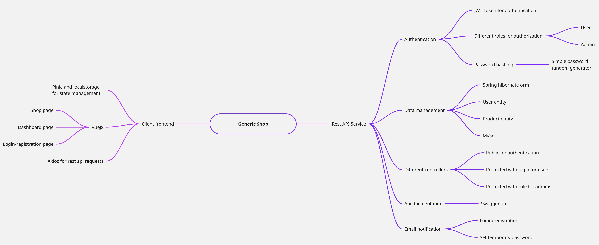
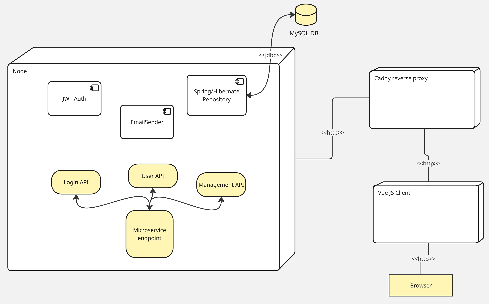

# AdminMicroservice
This is a simple project showing the implementation of a shop service with the following features:
- Basic ogin and registration
- JWT Token based authentication and authorization
- MySql relational dbms using Spring + Hibernate ORM
- Email notifications (such as login or change password)


## Publication
Use the following code to publish the image (only for developers)
```
docker buildx build  . --platform=linux/amd64,linux/arm64 -t ghcr.io/authenticationproject/adminmicroservice:latest --push
```

## Deploy
The easiest way to run the application is to use the Docker images published.

In order to run the application you need a Java environment and Docker installed.
You can run the docker compose to create the services containers for MySQL and the Spring microservice.
```
docker compose up
```

The Swagger API specifications are available from following url (after container deploy):
```
http://localhost:8090/swagger-ui.html
```